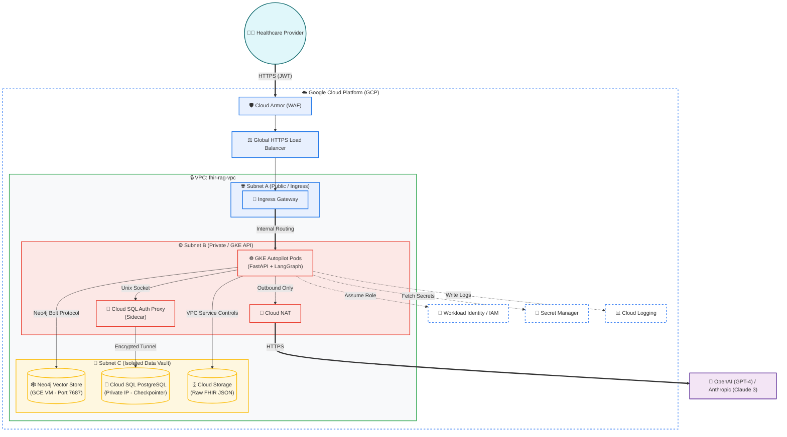

# Secure Clinical RAG Microservice for Healthcare

This project is a highly secure, production-grade Retrieval-Augmented Generation (RAG) microservice built for healthcare providers. It allows clinical staff to query disparate Fast Healthcare Interoperability Resources (FHIR) data using natural language, all while adhering to strict data isolation and compliance standards.

---

## 🛠️ Technology Stack & Tools Used

This architecture leverages a modern, cloud-native tech stack, prioritizing security, semantic understanding of clinical data, and scalability.

### 1. Application Layer & Orchestration
*   **[Python 3.11](https://www.python.org/):** The core programming language used for the backend service.
*   **[FastAPI](https://fastapi.tiangolo.com/):** A modern, high-performance web framework for building the REST API. Used to serve the RAG pipeline to the frontend, handling CORS, validation (via Pydantic), and async requests.
*   **[LangChain](https://python.langchain.com/):** The framework used for developing the LLM-driven application. It manages the prompts, vector store integrations, and caching.
*   **[LangGraph](https://python.langchain.com/docs/langgraph/):** A library for building stateful, multi-actor applications with LLMs. Used here to define the cyclical, workflow-based pipeline (`rewrite -> retrieve -> generate`) and manage conversation states across requests.

### 2. Data Storage & Retrieval (The Vault)
*   **[Neo4j](https://neo4j.com/):** A graph database utilized as the primary Vector Store. It stores both the clinical relationships (Graph) and the dense vector embeddings (Vector Index), enabling hybrid searches across patient records.
*   **[PostgreSQL](https://www.postgresql.org/) (via `psycopg`):** Used as the persistent LangGraph checkpointer. It stores conversation histories securely, ensuring context is maintained across browser sessions without keeping state in the API memory.
*   **[Redis](https://redis.io/):** Used for high-speed caching of both retrieval results (document chunks) and LLM generated responses, significantly reducing API latency and LLM token costs for repeated clinical queries.

### 3. Machine Learning & Embeddings
*   **[HuggingFace Embeddings](https://huggingface.co/):** Utilized to run localized embedding models.
*   **[PubMedBERT (`S-PubMedBert-MS-MARCO`)](https://huggingface.co/pritamdeka/S-PubMedBert-MS-MARCO):** A specialized embedding model pre-trained on medical literature. It is vastly superior to general models (like OpenAI `text-embedding-ada-002`) at understanding clinical terminology, abbreviations, and context.
*   **[OpenAI (GPT-4) / Anthropic (Claude 3)](https://openai.com/):** The core Large Language Models used for final response generation and query rewriting. The system uses a flexible abstraction allowing seamless switching between enterprise-grade foundation models based on clinical reasoning requirements.

### 4. Healthcare Data Processing
*   **FHIR (Fast Healthcare Interoperability Resources):** The global standard for health care data exchange. The app parses raw FHIR JSON bundles (`Patient`, `Observation`, `MedicationRequest`, etc.) into semantic text chunks optimized for LLM consumption.
*   **Custom Resource Parsers:** Python scripts tailored to extract meaningful clinical context from complex nested JSON structures while ignoring administrative noise.

### 5. Observability & Tracing
*   **[Langfuse](https://langfuse.com/):** An open-source LLM engineering platform. Used to trace the execution of the LangGraph pipeline, monitor token usage, track latency, and evaluate the quality of the LLM responses.

### 6. Cloud Infrastructure & Security (Google Cloud Platform)
*   **[Google Kubernetes Engine (GKE)](https://cloud.google.com/kubernetes-engine):** Runs the FastAPI microservice using Autopilot mode for hands-off node management and automatic scaling.
*   **[VPC (Virtual Private Cloud)](https://cloud.google.com/vpc):** The custom network topology that enforces "Castle and Moat" security.
*   **[Cloud SQL](https://cloud.google.com/sql):** Google's fully managed relational database service, hosting the PostgreSQL checkpointer on a strictly private IP.
*   **[Cloud SQL Auth Proxy](https://cloud.google.com/sql/docs/postgres/sql-proxy):** Runs as a sidecar container in GKE to establish an encrypted, IAM-authenticated tunnel to the database.
*   **[Cloud NAT](https://cloud.google.com/nat):** Allows the private GKE cluster to make outbound requests to the OpenAI/Anthropic APIs without exposing the cluster to inbound internet traffic.
*   **[Workload Identity](https://cloud.google.com/kubernetes-engine/docs/how-to/workload-identity):** Securely maps K8s service accounts to GCP IAM accounts, eliminating the need to store static JSON credentials in the cluster.
*   **[Secret Manager](https://cloud.google.com/secret-manager):** Securely stores the LLM API keys and database passwords.
*   **[Artifact Registry](https://cloud.google.com/artifact-registry):** Secure, private Docker image repository for the application containers.

---

## 🏗️ Architecture Overview

The system is deployed using a strict 3-tier VPC architecture on GCP, enforcing a "Zero Trust" model.



### Network Flow:
1.  **Subnet A (Ingress):** Handles incoming provider requests via a Global HTTPS Load Balancer protected by Cloud Armor (WAF).
2.  **Subnet B (Compute):** Hosts the GKE cluster running the LangGraph API. Nodes have no public IPs and use Cloud NAT for secure outbound LLM calls.
3.  **Subnet C (Data Vault):** A completely isolated subnet housing the Neo4j Vector Store VM and Cloud SQL checkpointer. Access is restricted exclusively to Subnet B via internal VPC routing.

---

## 🚀 Key Features

*   **Semantic Medical Search:** Understands the difference between similar clinical terms (e.g., "hypertension" vs "high blood pressure") using PubMedBERT.
*   **UUID Resolution:** Automatically resolves complex FHIR UUIDs into human-readable patient names *before* vector search to ensure high retrieval accuracy.
*   **Session Memory:** Maintains contextual chat history across requests using the LangGraph PostgreSQL checkpointer.
*   **Smart Query Rewriting:** Detects missing context in follow-up questions (e.g., "What is *his* blood pressure?") and rewrites them using conversation history.
*   **Resource-Aware Chunking:** Splits medical documents intelligently based on resource type (e.g., small chunks for Observations, large chunks for Patient Demographics).

---

## 🔐 HIPAA & Security Compliance
*   **Zero Public IPs** on any database or compute node.
*   **Encryption in transit** (HTTPS, Bolt+S, Cloud SQL Tunnel).
*   **Encryption at rest** on all GCP storage volumes.
*   **Principle of Least Privilege** enforced via IAM and Workload Identity.

---

## 🛠️ Getting Started (Local Development)

To run this project locally for development or testing, follow these steps:

### 1. Prerequisites
*   [Docker](https://www.docker.com/) and [Docker Compose](https://docs.docker.com/compose/)
*   [Python 3.11+](https://www.python.org/)
*   [Node.js and npm](https://nodejs.org/)
*   An **OpenRouter API Key** (Get one at [openrouter.ai](https://openrouter.ai/keys))

### 2. Infrastructure Setup
The project uses Docker Compose to manage Neo4j, PostgreSQL, Redis, and Langfuse.
```bash
cd rag
docker-compose up -d
```

### 3. Backend Setup
1.  Install dependencies:
    ```bash
    pip install -r requirements.txt
    ```
2.  Set your API key:
    ```bash
    export OPENROUTER_API_KEY="your_key_here"
    ```
3.  Start the FastAPI server:
    ```bash
    uvicorn server:app --reload --port 8000
    ```

### 4. Frontend Setup
1.  Navigate to the frontend directory:
    ```bash
    cd ../frontend
    ```
2.  Install dependencies:
    ```bash
    npm install
    ```
3.  Start the development server:
    ```bash
    npm run dev
    ```
    The application will be available at `http://localhost:5173`.

### 5. Running Evaluations
To run the Ragas evaluation suite:
```bash
cd ../rag
python evaluate_rag.py
```
